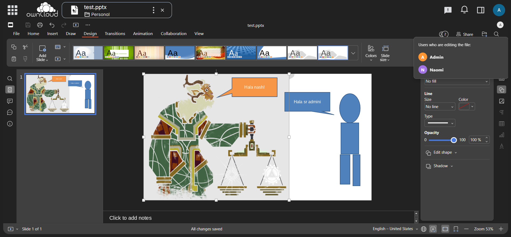

# Euro-Office + OCIS

Self-hosted document editing with [Euro-Office](https://github.com/Euro-Office) and [ownCloud Infinite Scale (OCIS)](https://github.com/owncloud/ocis). One `docker compose up` gives you a private office suite with real-time collaborative editing and file storage.

This is the first integration of Euro-Office with OCIS. Euro-Office is an open-source fork of OnlyOffice (AGPL-3.0) backed by Nextcloud, IONOS, and other European companies focused on digital sovereignty.



## What you get

- **Document editing:** Word, Excel, PowerPoint, and OpenDocument formats
- **File storage:** OCIS provides WebDAV, file sharing, and user management
- **Real-time collaboration:** Multiple users can edit the same document simultaneously
- **Lightweight:** ~757 MB total RAM with 2 active users (vs ~2-3 GB for Nextcloud + Collabora)
- **Self-contained:** No external dependencies

## Run locally

### Prerequisites

- [Docker](https://docs.docker.com/get-docker/) or [Podman](https://podman.io/getting-started/installation)
- [mkcert](https://github.com/FiloSottile/mkcert) for locally-trusted TLS certificates. Required because browsers block iframes with untrusted certificates, and OCIS sends HSTS headers that prevent manual certificate bypass

### Setup

```bash
git clone https://github.com/delmarguillen/euro-office-ocis.git
cd euro-office-ocis

# Generate trusted certificates
mkcert -install
mkdir -p certs
mkcert -cert-file certs/cert.pem -key-file certs/key.pem \
  "localhost" "*.localhost" "ocis.localhost" "docs.localhost"

# Start services
docker compose up -d
```

With Podman:

```bash
python -m podman_compose up -d
```

### Get admin password

```bash
docker exec euro-office-ocis cat /etc/ocis/ocis.yaml | grep admin_password
```

Open **https://ocis.localhost:8443** and log in with `admin` and the password above.

## Deploy on a VPS

### Prerequisites

- A Linux VPS (x86_64 or ARM64) with at least 2 GB RAM
- Docker installed (`curl -fsSL https://get.docker.com | sh`)

### Setup

```bash
git clone https://github.com/delmarguillen/euro-office-ocis.git
cd euro-office-ocis

# Replace with your server's public IP
export SERVER_IP=your.server.ip
sed "s/YOUR_IP/$SERVER_IP/g" docker-compose.vps.yml > docker-compose.yml
sed "s/YOUR_IP/$SERVER_IP/g" traefik/dynamic.vps.yml > traefik/dynamic.yml
sed "s/YOUR_IP/$SERVER_IP/g" config/ocis/csp.vps.yaml > config/ocis/csp.yaml

# Edit docker-compose.yml to set your email in the ACME config and admin password
# Then start services
docker compose up -d
```

Uses [nip.io](https://nip.io) for free DNS (no domain needed) and Let's Encrypt for TLS certificates.

Open **https://ocis.YOUR_IP.nip.io** and log in with `admin` and the password you set.

## Architecture

```
Browser ──HTTPS──► Traefik ──HTTP:9200──► OCIS
                     │
                     └──HTTP:80──► Euro-Office DocumentServer

Collaboration service connects OCIS and DocumentServer via WOPI protocol
```

| Service | Image | RAM | Role |
|---|---|---|---|
| Traefik | `traefik:v3.4` | ~34 MB | TLS termination, routing by hostname |
| OCIS | `owncloud/ocis:latest` | ~232 MB | File storage, user auth, web UI |
| Collaboration | `owncloud/ocis:latest` | ~42 MB | WOPI bridge between OCIS and DocumentServer |
| DocumentServer | `ghcr.io/euro-office/documentserver:latest` | ~449 MB | Document rendering and editing engine |

Measured on a 2 vCPU / 4 GB VPS with 2 concurrent users editing documents. Total: ~757 MB RAM, ~8% CPU.

### How it works

- **Traefik** terminates TLS and routes requests by `Host` header. It has network aliases so containers can resolve these domains internally, this solves the `COLLABORATION_APP_ADDR` dual-use problem (the same URL must work from both the browser and server-to-server).
- **CSP config** (`config/ocis/csp.yaml`) whitelists the DocumentServer domain in the `frame-src` directive, allowing the editor iframe to load.
- **WOPI proof key patch** (`config/documentserver/entrypoint-override.sh`) converts the auto-generated PKCS#8 private key to PKCS#1 format. The bundled Node.js crypto module fails to sign with PKCS#8 keys on both x86_64 and ARM64. This patch runs automatically at container startup before the health check passes.

## Hardware requirements

Tested on a VPS (2 vCPU, 4 GB RAM, x86_64). ~757 MB RAM and ~8% CPU with 2 concurrent users.

### VPS

| Spec | Minimum | Tested |
|---|---|---|
| RAM | 2 GB (1-2 users) | 4 GB (5-10 users) |
| CPU | 1 vCPU | 2 vCPU |
| Disk | 10 GB | 40 GB |

Baseline usage is ~757 MB RAM with 2 concurrent users. RAM increases with more users and open documents.

### Raspberry Pi

| Hardware | Viability |
|---|---|
| Raspberry Pi 4 (2 GB) | 1-2 users |
| Raspberry Pi 4 (4 GB) | 3-5 users |
| Raspberry Pi 4 (8 GB) | 5-10 users |

Use an SSD over USB instead of an SD card, DocumentServer does significant I/O.

## Configuration

### JWT authentication

JWT is disabled by default (`JWT_ENABLED=false`) for simplicity. For production, enable it by setting a shared secret:

```yaml
# In docker-compose.yml, documentserver service:
environment:
  JWT_ENABLED: "true"
  JWT_SECRET: "your-shared-secret"

# In docker-compose.yml, collaboration service:
environment:
  COLLABORATION_APP_JWT_SECRET: "your-shared-secret"
```

### Fixed admin password

```yaml
# In docker-compose.yml, ocis service:
environment:
  IDM_ADMIN_PASSWORD: "your-password"
```

### Port

The default port is 8443 (local) or 443 (VPS). To change it, update the Traefik entrypoint in `docker-compose.yml` and all `OCIS_URL` / `COLLABORATION_APP_ADDR` references.

## File structure

```
├── docker-compose.yml                  # Local dev (*.localhost + mkcert)
├── docker-compose.vps.yml              # VPS template (nip.io + Let's Encrypt)
├── traefik/
│   ├── dynamic.yml                     # Traefik routing (local)
│   └── dynamic.vps.yml                 # Traefik routing (VPS template)
├── config/
│   ├── ocis/
│   │   ├── csp.yaml                    # Content Security Policy (local)
│   │   ├── csp.vps.yaml               # Content Security Policy (VPS template)
│   │   └── app-registry.yaml           # MIME type to editor mapping
│   └── documentserver/
│       └── entrypoint-override.sh      # WOPI key format patch
└── certs/                              # TLS certs (generated locally, not committed)
    ├── cert.pem
    └── key.pem
```

## Known limitations

- **20 simultaneous connections:** Inherited from OnlyOffice Community Edition. This is a code limitation in the C++ core, not a Euro-Office policy. There is no Euro-Office license to purchase.
- **Sharp module warning on ARM64/QEMU:** Image thumbnail generation is unavailable under emulation. Images in documents still work; only preview optimization is affected.

## License

AGPL-3.0, same as Euro-Office and OCIS.

## Links

- [Euro-Office](https://github.com/Euro-Office), Document editing engine
- [OCIS](https://github.com/owncloud/ocis), File storage and collaboration platform
- [OCIS deployment examples](https://github.com/owncloud/ocis/tree/master/deployments/examples/ocis_full), Official reference used as base
